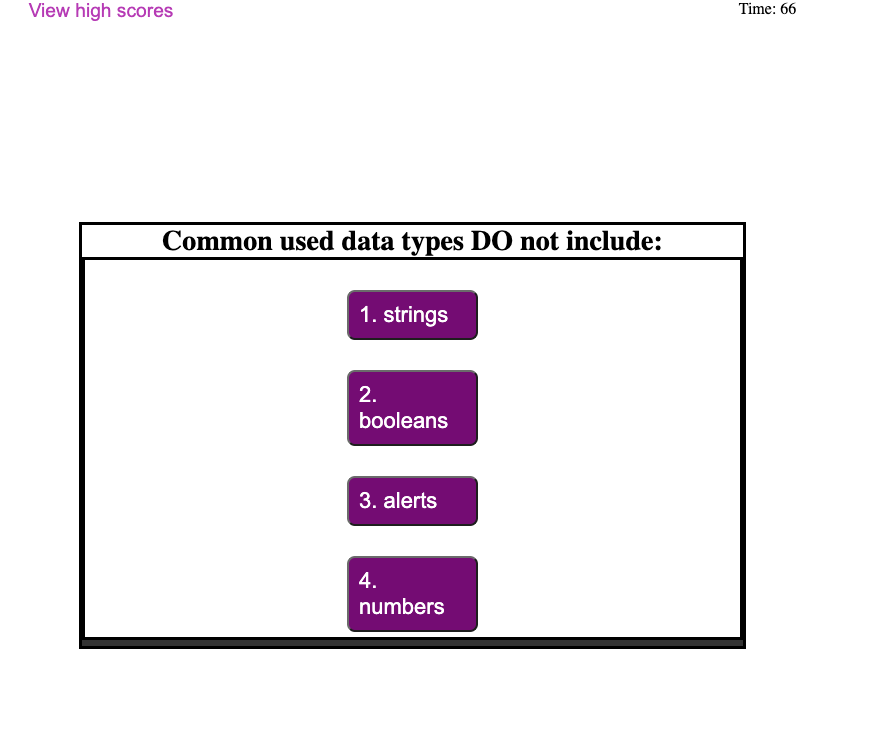

# Code-Quiz 

[Description](#decription)

[Built With](#built-with)

[Link](#link)

[Screenshot](#screenshot-of-home-page)
## Description 

As you proceed in your journey to becoming a full-stack web developer, it’s likely that you’ll be asked to complete a coding assessment, perhaps as part of an interview process. A typical coding assessment is a combination of multiple-choice questions and interactive coding challenges.

To help you become familiar with these tests and give you a chance to apply the skills from this module, this week’s Challenge invites you to build a timed coding quiz with multiple-choice questions. This app will run in the browser, and will feature dynamically updated HTML and CSS powered by JavaScript code that you write. It will have a clean, polished, and responsive user interface. This week’s coursework will teach you all the skills you need to succeed in this assignment.

## Built With 

* HTML
* CSS
* JavaScript

## Link

URL of the deployed application: https://undisputed06.github.io/code-quiz/
## Screenshot of Home Page

## Questions
[My Github Profile](https://github.com/Undisputed06)
  

